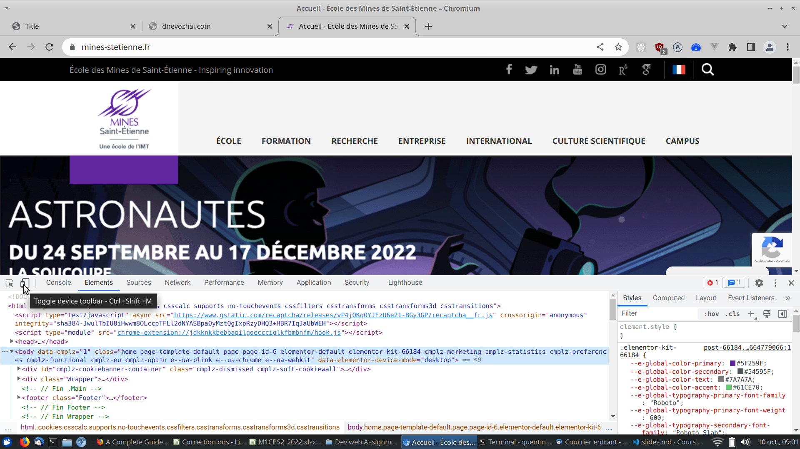
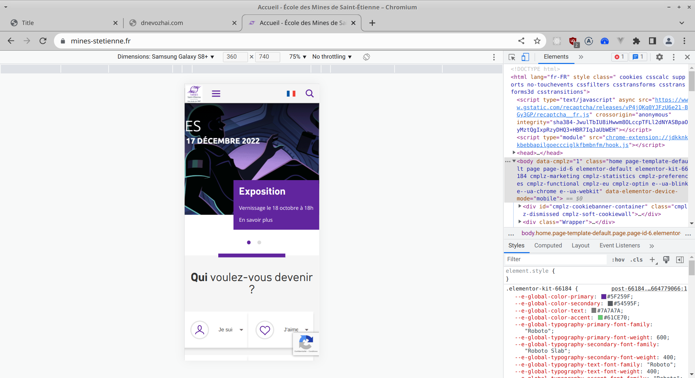

# Frontend Web Development - Responsive Web Frontend Development

Quentin Richaud

qrichaud.pro@gmail.com

---

# Different client devices

Since the 2010s', we need to account for different kind of devices accessing our websites : smartphones, tablets and laptops.

Difference between those devices :

- Screen size (obviously)
- Screen ratio (landscape vs. portrait)
- Different mean of input (mouse vs touchscreen, physical vs virtual keyboard, clicks vs. gestures).

---

# Responsive design

Responsive design is the art of making a ressource suited for all kind of device accessing it.

Examples of not responsive designs :

- badly designed for smartphones : https://old.reddit.com/ , https://docs.oracle.com/javase%2F7%2Fdocs%2Fapi%2F%2F/overview-summary.html
- badly designed for laptops (unfortunately a rising trend) : https://www.tnp-villeurbanne.com/ , https://www.ter.sncf.com/auvergne-rhone-alpes

---

# Responsive design

When doing responsive design, there are 2 approaches :

- desktop first : the classic way
- mobile first

Example of good mobile first : https://www.apple.com/

---

# Responsive design

The problem of responsive design is at first a problem of UX design (so not really your job as a developper, although
having a good grasp of UX is a plus).

In a second time, it becomes a technical problem : how do we implement a website that will render 
differently on 2 devices.

For this 2nd problem, the languages and browsers API give us some tools to do it. However some designs may be 
more or less easy to implement.

---

# Responsive design

The main constraints of a website designed for a good smartphone accessibility:
- The screen is small. How to display efficiently all your data while keeping it readable.
- The pointer method (fingers) is not accurate. You can't have small links or buttons.

On a small screen, you will be able to display less information in the same time, and 
you need to 
be smart on the way to navigate towards all the information your website should provide.

---

# Responsive design

We can't really make a single design that looks good both on desktop and smartphone. 

We need to have different designs depending on the screen size, (elements positionned differently,
menus becoming hidden by default and expanded with a button, etc.), and having our website
change its shape depending on the device.

To achieve this there are 2 strategies :

- Having 2 separate websites, one for mobile, one for desktop, and having the server smartly serving the one or the other 
  depending on the kind of client making the request. This more of a backend solution.
- Having only one adaptive website, which will have elements displaying differently in the web browser depending on the 
  client properties. This is more of a frontend solution.

---

# Example : two different websites

Wikipedia has this strategy. Their desktop website is at https://fr.wikipedia.org.

Their mobile website is at https://fr.m.wikipedia.org

The server is going to reply with one website or the other, it guesses your devices thanks to the data
sent in the HTTP request headers.

---

# Example : single adaptive website

The EMSE website works great to illustrate this method : https://www.mines-stetienne.fr/

---

# A mobile website vs. a mobile native application

Nowadays, you need to assume that every website should and will be accessed on mobile device. 

However not every website needs to be converted to a mobile application. (Example : https://www.mines-stetienne.fr/)

For some other websites, it isn't clear cut. For example, does wikipedia, or amazon, warrant a dedicated mobile application,
or is a mobile website enough.

Finally, some heavy featured applications are better as native apps than websites (example : Spotify).

---

# Mobile website vs. native application


The advantages of a website designed for mobile vs. a native mobile application:
- more portable
- no installation required
- easy to update

The disadvantages : 
- slower (especially for heavy features, multimedia, screen gestures & animations…)
- don't have access to native OS functionalities

---

# Presenting Chrome Developper Tools for mobile development



---

# Presenting Chrome Developper Tools for mobile development



---

# Our tools as developpers to make a responsive website

Thinking the way we make our CSS, to be sure the elements behave nicely at different page sizes.

Even without changing the design of the webpage, there are many adjustements that can be done to 
avoid clunky behavior when the window size changes.

Try to reduce your browser window when you develop, in order to see how the elements behave
when the page width changes.

The parameters we can adjust : 
- Thinking about the behavior of elements when overflow occurs
- Think our sizes (height, width, …) in relative units (percentages, viewport width, vieport height, em) instead
  of absolute
- Applying max/min sizes property

*See demo code 1*

---

# Tools for responsive website development

Flexbox and CSS Grid for a powerfull layouting.

Because these features are more recent, they have built-in ways to deal with changing screen size.

Flexbox especially has interesting features :
- we can change the order of elements 
- we can define how the elements will grow or shrink to use the available container space
- we can wrap elements : they will dispay on several lines if not enough space is available in the container flex direction


*See demo code 2 & 3*

---

# Tools for responsive website development

CSS media queries : having CSS rules applying conditionnaly depending on the property of the display.

---


# CSS media queries

```css
@media media-type and (media-feature-rule) {
  /* CSS rules go here */
}
```

---

# CSS media queries

Media types : `screen`, `print` and all. We are almost always going to use `screen`.

Example below : CSS rule for a screen smaller than 400px width. 

```css
@media screen and (max-width: 400px) {
  body {
    color: blue;
  }
}
```

---

# CSS media queries

Another kind of query : the orientation of the display.

```css
@media (orientation: landscape) {
  body {
    color: rebeccapurple;
  }
}
```

---

# CSS media queries


Example of another kind of media query selector : select a medium sized screen by 
combining two rules. (This is usually to target a tablet).


```css
@media (min-width: 400px) and (max-width: 1024px) {
  /* CSS rules go here */
}
```

*See demo code 4 & 5*

---

# The viewport meta tag

```html
<meta name="viewport" content="width=device-width,initial-scale=1" />
```

From MDN : 

This is the viewport meta tag — it exists as a way to control how mobile browsers render content. This is needed because by default, most mobile browsers lie about their viewport width. Non-responsive sites commonly look really bad when rendered in a narrow viewport, so mobile browsers usually render the site with a viewport width wider than the real device width by default (usually 980 pixels), and then shrink the rendered result so that it fits in the display.

This is all well and good, but it means that responsive sites are not going to work as expected. If the viewport width is reported as 980 pixels, then mobile layouts (for example created using a media query of @media screen and (max-width: 600px) { }) are not going to render as expected.

---

To remedy this, including a viewport meta tag like the one above on your page tells the browser "don't render the content with a 980 pixel viewport — render it using the real device width instead, and set a default initial scale level for better consistency." The media queries will then kick in as expected.


---

# Media queries : defining break points and screen sizes

Media queries are really flexible, but you want to have some guidelines in order to write well organized code.

A good practice is to define a few breakpoints at which your website is going to change. You don't want to make media queries
at random sizes.

For example : You have a design for only 2 screen sizes : small (smartphone) and large (everything else). You define
the breakpoint for the small screen at 480px wide, everything higher will be considered to be the large screen.

---

Beware ! This doesn't mean everything "large" is going to be as wide as a desktop screen. You'll still have tablets,
old computer displays (1024px, but very uncommon now), or big smartphone on landscape mode. 

You still need to think your CSS rules to behave nicely when the screen size reduce, even if it doesn't go to the breakpoint.

You can have designs with more breakpoints (3, or 4 screen sizes, different orientations), but it is going to be 
more time consuming, both in developpment and maintainance of your website.

---

# Media queries : help with SCSS

If your breakpoints are complicated, it quickly becomes tedious to write the conditions in the media queries each time
you need to apply a CSS rule for your target screen.

Example : we defined a breakpoint for a mobile landscape screen as follow : screen width < 1000px & orientation landscape.

For each CSS rule that needs to apply to this screen, we need to write this :

```css
@media (max-width: 1000px) and (orientation: landscape) {
  /* CSS rule */
}
```

---

# Media queries : help with SCSS

Sass (=SCSS) has different functionalities that can help us with less verbose and more.

There are several tools in the Sass languages that can alleviate this problem. This article
describes many (with pros and cons) : https://css-tricks.com/approaches-media-queries-sass/

My preferred method :

```scss
$mobile-landscape-width: 1000px;

@mixin mobile-landscape {
  @media (orientation: landscape) and (max-width: $mobile-landscape) {
    @content;
  }
}
```

```scss
@include mobile-landscape {
  /* CSS rule here applies only to mobile-landscape screen */
}
```

---

# Enhance your responsive experience with dedicated JS

You should rely as best as you can on CSS to make your website responsive. Although
you could also conditionnally display and hide elements with JS. There are some 
problems to use JS primarily for that.

However it is good practice to enhance the functionality of your responsive design
by using JS in conjunction with CSS media queries. See the demo n° 6 for an example
of mobile responsive menu with JS.

JS frontend frameworks (such as VueJS) will also have built-in tools to help 
you make your website responsive. However this is not within the scope of this lecture. 

---

# Bonus : simulating slow bandwidth

Another aspect of mobile website development, is to think of the fact that on mobile, it is 
more likely that user experience a slow bandwidth.

When designing your website, you should account for user experience during loading times : 
how do you do visual feedback that an action as been taken into account but is slow to proceed ?
that content is being loaded ?

You can simulate a slow bandwidth with the chrome developper tools.

Example with https://www.thefork.fr/

---

# Live coding examples

You can find illustration of good practices in the repository `./demo_code`. Each example 
has the `style_bad.css` file, with CSS that is not adapted to several screen sizes. And
the `style_good.css` file, with a few modifications made in order to make the CSS working
nicely on all screen sizes.

---

# Assignment

To put this principles in practice, you have to do the assignment described in the directory `./assignment`.


You will find the instructions in the document `./assignment/instructions.md`

I will give a small grade to this assignment. It is due for the 18/12/2023 in the evening.

Submission procedure : 

- Send it as a git repository (be sure to make it public, so I don't have access issues),
  or send it as a ZIP folder to my email address.
- Use the email address : qrichaud.pro@gmail.com
